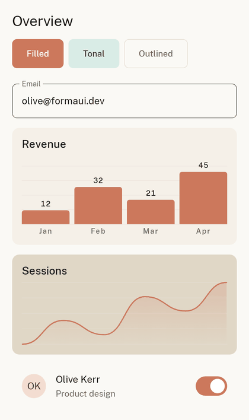
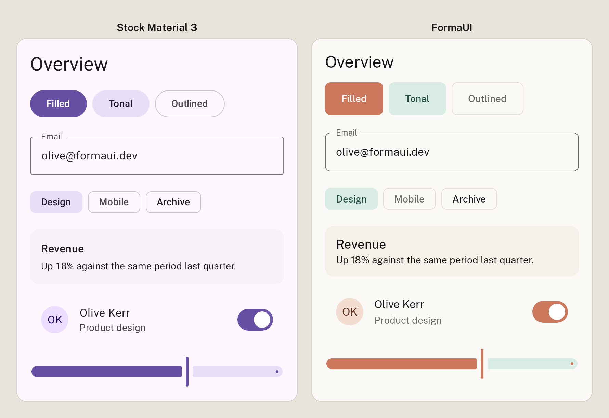

<div align="center">

<!-- alt is deliberately empty: the <h1> directly below already announces
     "FormaUI", and captioning the mark too would read it twice on a screen
     reader. The dark source exists because the mark's ink bar is near-black
     (see docs/assets/formaui-mark-dark.svg). -->
<picture>
  <source media="(prefers-color-scheme: dark)" srcset="docs/assets/formaui-mark-dark.svg">
  
</picture>

# FormaUI

**Opinionated, Material You-native Jetpack Compose components that look great with zero styling work.**

[](https://central.sonatype.com/artifact/dev.formaui/components)
[](https://github.com/devsnackio/forma-ui/actions/workflows/ci.yml)
[](https://kotlinlang.org)
[](https://developer.android.com)
[](LICENSE)

[Documentation](https://formaui.dev) · [Components](#components) · [Theming](#theming) · [Changelog](CHANGELOG.md) · [Contributing](CONTRIBUTING.md)

<br>



### 👉 [Try all 40 components live in your browser](https://formaui.dev/components)

<sub>Not screenshots — the real components, compiled to WebAssembly and running on the page.</sub>

</div>

---

## Install

```kotlin
dependencies {
    implementation("dev.formaui:components:0.2.0") // transitively brings in :core
    // or depend on the theming engine alone:
    // implementation("dev.formaui:core:0.2.0")
}
```

**Requirements:** Android `minSdk 24`+, Kotlin 2.4.x, Material 3. **Android is the only published target.**

> `0.2.0` is the current release. The Maven Central badge above always shows what is actually published.

> **Moved from `io.github.devsnackio` in `0.2.0`.** Releases up to `0.1.0` shipped under that group, before the `formaui.dev` domain was owned. Only the coordinate changed — imports were always `dev.formaui.*`, so migrating is a one-line edit to your dependency. Relocation POMs keep old builds resolving, but the retired group gets no further releases.

### Does it clash with the AndroidX Compose BOM?

No. This comes up because FormaUI's POM declares `org.jetbrains.compose.*` (JetBrains' Compose Multiplatform distribution) rather than `androidx.compose.*`, and almost every Android app gets Compose from the AndroidX BOM.

It works because on Android the JetBrains artifacts **depend on** the AndroidX ones rather than duplicating them — `org.jetbrains.compose.material3:material3:1.9.0` resolves `androidx.compose.material3:material3` transitively, and Gradle's normal conflict resolution then aligns those on whatever version your BOM pins. There are no duplicate classes to exclude and nothing to configure.

Verified by building a stock Compose app — AndroidX Compose BOM `2026.08.00`, AGP 9.3.1, Gradle 9.6 — with `dev.formaui:components:0.2.0` added and no exclusions: `assembleDebug` compiles, dexes and packages cleanly. Reproduce it with `./gradlew :app:dependencies` on your own project if you'd rather check than take our word for it.

## Quick start

Wrap your app in `FormaTheme` and drop in components. Because the APIs are experimental pre-1.0, opt in where you use them:

```kotlin
@OptIn(ExperimentalFormaUiApi::class)
@Composable
fun App() {
    FormaTheme {                       // brand palette by default; pass dynamicColor = true for Material You on Android 12+
        Column {
            FormaButton(onClick = { /* … */ }) { Text("Get started") }

            var query by remember { mutableStateOf("") }
            FormaTextField(
                value = query,
                onValueChange = { query = it },
                label = "Search",
            )

            FormaCard(variant = FormaCardVariant.Elevated) {
                Text("Cards, chips, sheets, and 37 more — all themed to match.")
            }
        }
    }
}
```

No theme file, no spacing scale, no five button wrappers.

## What is FormaUI?

FormaUI is a [Jetpack Compose](https://developer.android.com/jetpack/compose) component library for **Android**, built as a **themed layer on top of Material 3** — production-ready components with better defaults, so you can ship fast instead of building a design system from scratch.

**The positioning wedge:** Unlike headless/unstyled toolkits (e.g. Composables UI — "Compose without Material"), FormaUI is deliberately **opinionated and Material 3-native**. Components ship with a warm-editorial look — Public Sans with an editorial display scale over a cream/coral palette — yet still feel like the Material 3 you already know (and Material You dynamic color is one flag away), so anyone productive in Compose Material 3 is productive in FormaUI within minutes.

The same screen, in stock Material 3 and in FormaUI — identical widgets, identical copy, only the theme differs:

<div align="center">

</div>

- **Designed out of the box** — ships with the **Public Sans** typeface, an editorial display scale (64sp display tier, negative tracking, Medium-weight labels), a warm-editorial palette (cream canvas, coral primary, warm ink text, dark-navy dark scheme), and 8dp default corners instead of Material's pill buttons — so components don't read as stock Material.
- **Charts, with no extra dependency** — bar, line and donut built on Compose `Canvas`, themed with everything else, animated on entry, and each generating a screen-reader summary automatically. See [Charts](#charts).
- **Zero-config, and the theme is replaceable** — every component works with just its required params, and colour, typography, shape and spacing are all replaceable at the theme level. See [Theming](#theming) for exactly what's replaceable and what isn't.
- **Material You, one flag away** — the brand palette is the default; opt into wallpaper-based dynamic color with `FormaTheme(dynamicColor = true)` on Android 12+.
- **Accessibility taken seriously** — charts generate screen-reader summaries with no configuration, interactive components clear the 48dp touch target, and semantics roles and content descriptions are part of the definition of done for every component.
- **Slot-based & state-hoisted** — standard Compose conventions, no unfamiliar parallel API.
- **Well tested** — 288 tests across 47 files, and no component ships without one. That's 8,429 lines of test code against 6,780 lines of component and theming implementation, with a further 3,007 lines of `@Preview` code on top.

> **Pre-1.0.** All public APIs are annotated `@ExperimentalFormaUiApi` while the surface stabilizes. Expect breaking changes before `1.0.0`.

## Charts

Bar, line and donut charts are part of `:components` — pure Compose `Canvas`, no third-party chart library, themed with the rest of the system.

```kotlin
FormaBarChart(
    entries = listOf(
        FormaChartEntry("Jan", 12f),
        FormaChartEntry("Feb", 32f),
        FormaChartEntry("Mar", 21f),
        FormaChartEntry("Apr", 45f),
    ),
)
```

- **Animated entry** — bars grow from the baseline, the line sweeps in, donut arcs reveal. An equal-but-new data list won't replay the animation.
- **Friendly axes** — maxima round to 1 / 2 / 2.5 / 5 × 10ⁿ so the top gridline lands on a readable number.
- **Accessible by default** — every chart generates its own screen-reader summary: *"Bar chart with 4 categories. Jan: 12. Feb: 32. Mar: 21. Apr: 45."*
- **Tested by pixel capture**, not just semantics — a chart that renders nothing still passes every semantics assertion, so the chart tests capture actual drawn pixels.

**These are presentation charts.** There's no gesture layer yet: no tooltips, no touch scrubbing, no tap-to-select.

## Theming

`FormaTheme` layers FormaUI tokens on top of Material 3's `ColorScheme`:

```kotlin
@Composable
fun FormaTheme(
    colorScheme: FormaColorScheme = FormaTheme.defaultColorScheme(),
    typography: FormaTypography = FormaTheme.defaultTypography(),
    shapes: FormaShapes = FormaTheme.defaultShapes(),
    spacing: FormaSpacing = FormaTheme.defaultSpacing(),   // the 4dp grid, retunable
    dynamicColor: Boolean = false,              // brand palette by default; true = Material You on Android 12+
    darkTheme: Boolean = isSystemInDarkTheme(),  // force light/dark, or follow the system
    content: @Composable () -> Unit,
)
```

Read tokens anywhere inside the theme via `FormaTheme.colorScheme`, `FormaTheme.typography`, `FormaTheme.shapes`, and `FormaTheme.spacing`. Design tokens:

- **`FormaColorScheme`** — light + dark brand palettes, fully replaceable. Coral, teal and amber are identical across both schemes, so dark mode reads as the same brand at night rather than a desaturated inversion.
- **`FormaTypography`** — an editorial Public Sans type scale plus a tabular-figures `numeric` style for financial/data display, so digits don't jitter as values update.
- **`FormaShapes`** — corner tiers `none` / `xs` 4 / `sm` 6 / `md` 8 / `lg` 12 / `xl` 16 / `pill` / `full`. These also feed Material 3's five shape slots, so raw M3 components inside `FormaTheme` inherit FormaUI's corners for free.
- **`FormaSpacing`** — a 4dp grid (`xxs` 4 / `xs` 8 / `sm` 12 / `md` 16 / `lg` 24 / `xl` 32 / `xxl` 48 / `section` 96); components use these internally, never hardcoded dp.

**What's replaceable:** every component takes a `modifier`. Colour, typography, shape and spacing are replaceable wholesale at the theme level — pass your own `FormaColorScheme`, `FormaTypography`, `FormaShapes` and `FormaSpacing` and none of FormaUI's look survives. Per-component, Material 3's `colors` and `shape` are forwarded wherever Material 3 exposes them, so you're never worse off than raw M3.

**What isn't:** the spacing *scale* is global rather than per-component — every component measures against the same `FormaSpacing`, so retuning it moves the whole system together rather than letting one component drift.

**Already using Material 3?** Wrap your existing app in `FormaTheme` and your current Material 3 components pick up FormaUI's type scale and corners immediately — then adopt `Forma*` components incrementally, or not at all.

## Components

All 40 components (the 18 in the original Phase 1 scope, plus 22 extras), each with variants/states, KDoc, `@Preview`s, and UI tests:

| | | |
|---|---|---|
| **Button** — filled/outlined/text/elevated/tonal | **TextField** — outlined/filled, error/disabled, icons, helper text | **Card** — elevated/outlined/filled, header/content/footer, clickable |
| **Chip** — assist/filter/input/suggestion | **Badge** — dot/numeric/overflow + `FormaBadgedBox` | **Switch** |
| **Checkbox** | **RadioButton** | **Dialog** — alert + full-screen |
| **BottomSheet** — modal | **NavigationBar** — with per-item badges | **ListItem** — one/two/three-line, slots, clickable |
| **Avatar** — initials/icon/image slot, sized | **Divider** — horizontal/vertical | **LoadingIndicator** — circular/linear, determinate/indeterminate |
| **EmptyState** — icon + title + description + action | **Snackbar** — standard + action, `FormaSnackbarHost` | **Slider** |
| **TopAppBar** — small/center-aligned/medium/large | **FloatingActionButton** — small/regular/large + extended | **IconButton** — standard/filled/tonal/outlined |
| **BottomAppBar** — actions + optional FAB | **DropdownMenu** — items with leading/trailing icons | **NavigationDrawer** — modal, slot-based items |
| **NavigationRail** — with badges + optional header | **SearchBar** — docked + full-screen | **SegmentedButton** — single/multi-select |
| **TabRow** — primary/secondary, fixed/scrollable | **Tooltip** — plain + rich | **ExposedDropdownMenu** — autocomplete, editable/tap-to-select |
| **DatePickerSheet** — calendar + text-input, in a sheet | **DateRangePickerSheet** — start/end range, in a sheet | **TimePickerSheet** — clock dial + text input, in a sheet |
| **RangeSlider** — two-thumb, continuous/stepped | **Carousel** — multi-browse/uncontained, snapping | **PullToRefresh** — swipe-down refresh, indicator slot |
| **SwipeToDismiss** — per-direction, background slot | **BarChart** — gridlines, value labels, entry animation | **DonutChart** — arc segments, center slot, legend |
| **LineChart** — smooth/straight, area fill, markers | | |

### What's thin and what isn't

About a dozen of these are thin wrappers over Material 3 — `FormaSwitch`, `FormaCheckbox`, `FormaSlider` and friends forward straight through. That's deliberate: they exist so you write `FormaSwitch` next to `FormaButton` instead of context-switching between namespaces, and so the API surface is ours when something needs to change. The work is in the theme layer and in the components that aren't thin: Button, Card, TextField, the three charts, the three picker sheets, and EmptyState.

## When *not* to use FormaUI

- **You're building your own design system.** Use [Compose Unstyled](https://composables.com/compose-unstyled) — it's headless by design and it's the right tool for that job.
- **Google's look is right for your product.** Use Material 3 directly. It's first-party and free.
- **You need iOS, desktop or web.** FormaUI is an Android library. The live previews on the docs site are the same source compiled to WebAssembly so the documentation can be interactive — that's a docs build, not a target you can ship to.

## Try it — sample app

A runnable showcase app demonstrates every component live, with light/dark and dynamic-color toggles:

```bash
./gradlew :sample:installDebug   # with an emulator/device connected, then launch "FormaUI Sample"
```

Or open the project in Android Studio and run the **`sample`** configuration. The sample screen is itself built entirely from FormaUI components — it doubles as a reference usage example.

## Project structure

```
core/          # Theming engine: FormaTheme, color/typography/spacing/shape tokens (zero FormaUI deps)
components/    # The 40 components (depends on :core)
sample/        # Runnable Android showcase app
build-logic/   # Gradle convention plugins
```

Targets: **Android** (the published artifact) and **`wasmJs`** (compiled for the live component previews embedded in the docs site).

The screenshots above are generated, not photographed — `docs/gen-marketing-assets.py` composites captures written by a Robolectric test, so they can never drift from what the components actually render.

## License

FormaUI `core` and `components` are licensed under the [Apache License 2.0](LICENSE).

---

<div align="center">
Built by <a href="https://github.com/devsnackio">DevSnack</a> · Docs & live previews at <a href="https://formaui.dev">formaui.dev</a>
</div>
